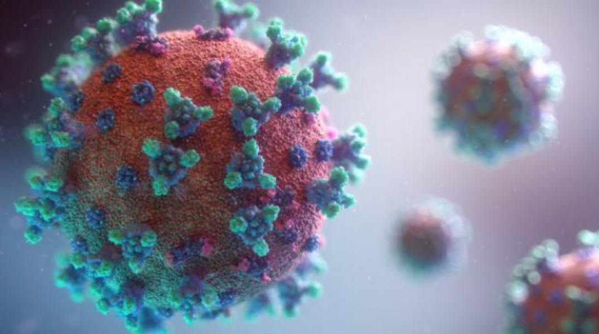
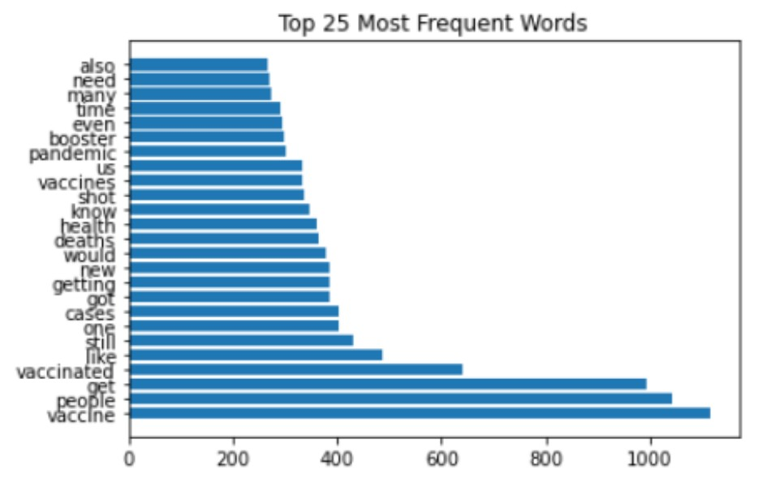
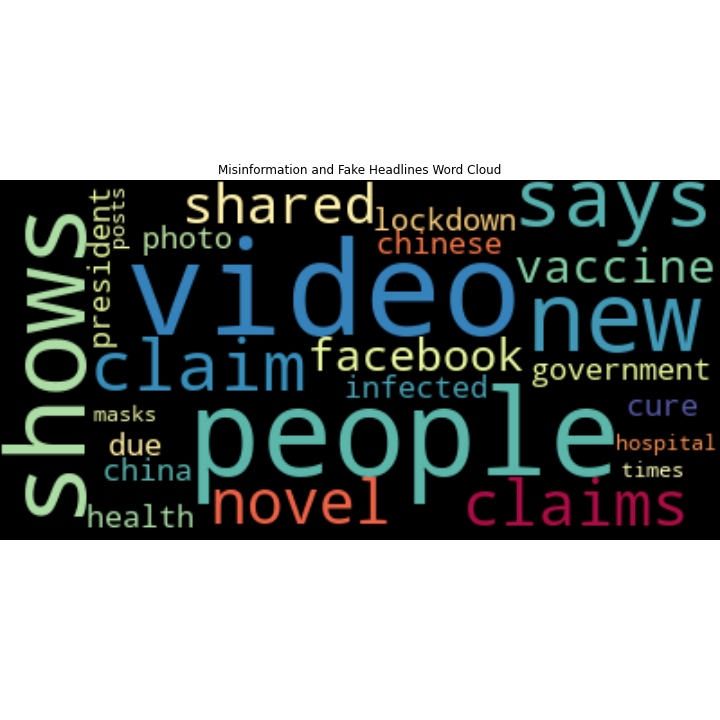
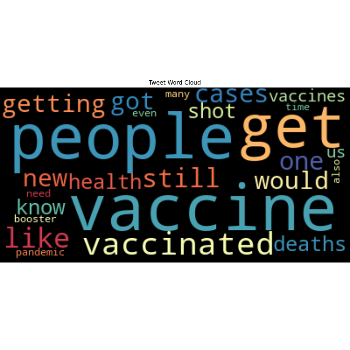
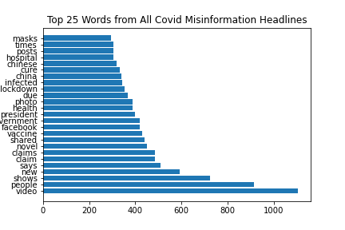
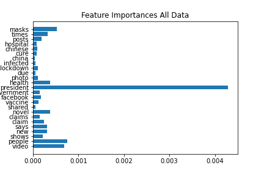

# Classifying Tweets COVID-19 Tweets

## Business Problem
Augment Twitter's in-house Data Science department'S predictive modeling for flagging tweets. The objective is to create an auxiliary model for flagging misleading tweets.  As Twitter's in-house department concentrates on data obtained from tweets themselves, the aim is to investigate factual and fictional news headlines to build a complementary model for evaluating tweets.

Several datasets were combined to diversify what the model would see.  Two datasets are COVID misinformation datasets - one compiled by Zenodo, a general-purpose open-access repository developed under the European OpenAIRE program and operated by CERN. The other compiled by Empirical Studies of Conflict, a Princeton and Stanford research project. The other two datasets are from Kaggle. One composed of headlines from The Huffington Post and The Onion which is to say it contains factual and sarcastic headlines. The other is a dataset of real and fake headlines from various news outlets.  

In total, 111,928 headlines were analyzed containing 61,114 factual headlines and 50,814 fictional headlines.

Twint was used to obtain tweets from February through September of 2021 with the majority of tweets coming from those two months. The keywords COVID, COVID-19, and coronavirus were used to refine the search. 11,029 tweets in 39 languages were procured. Those tweets were pared down to 7638 English tweets.  

Of the most frequent words found in these tweets, it is of note that people were heavily focused on vaccines and the vaccinated. This is further reinforced by the oft used words cases, deaths, health, shot and boosters. 

These word clouds were generated using the 25 most frequent words found in each dataset. Notice that the overlap found between them is in the words people and vaccine, reinforcing the observation found when solely looking at COVID tweets. Additionally of note is the presence of Facebook in the misinformation headlines. Although Twitter and WhatsApp are also encountered in the misinformation headlines, Facebook is more than two and a half times more prevalent than these other messaging apps.  

Post modeling, I compared the most frequent words in COVID misinformation headlines with the feature importances of words obtained from a Random Forest base model ran on all headlines. The overwhelming presence of the word president in the feature importances bar graph on the right can be attributed to 89% of the headlines data occurring between March 2015 and June 2018. Observe, however, the relevance of the words masks, health, novel - as in novel coronavirus, people, and video. During the early months of the pandemic, a misinformation and conspiracy theory documentary video entitled PLANDEMIC was released online then subsequently widely shared on social media platforms - especially via Twitter. The video campaign amplified negative sentiments regarding vaccination and containment measures among conspiracy theorists and subsequently spread to the general public. These effects possibly have an indirect impact on the public’s willingness to comply with public health measures.

Using 5-fold cross validation for optimal data usage along with variance smoothing for calculation stability, the probabilistic Gaussian Naive Bayes estimator yielded the best model for my rubric, finishing with an accuracy of 80%. While an accuracy of 80% is not what I would call stellar performance, my goal was not to create a flawless model for future sentiment analysis. I wanted the model to flag ALL potential misleading or misinformative tweets and therefore I strove to implement a model that would not misclassify ANY potentially harmful tweets. Therefore, I was more concerned with the recall score which, when high, would signify the model having a high false positive rate.

## Summary and Recommnedations
Particular care should be taken when examining flagged tweets. I recommend flagging or outright removing misinformative tweets as well as devising an icon to annotate confusing or misleading ones. Furthermore, by compiling a list of known conspiracy theory groups and their advocates, you would be better prepared to recognize and flag misinformation at the earliest time possible.  Lastly, assembling and upkeeping an ongoing keywords list culled from current headlines to incorporate into the model would additionally reduce the time it would take to track misinformation.

In the future, I suggest compiling a more current news headlines dataset as the outdated headlines dataset used for this model affected performance. If you so choose to gather a list of repeated misinformation spreaders and conspiracy theory groups, I have begun one for your use which can be found in the folder entitled GenInfoGather.

